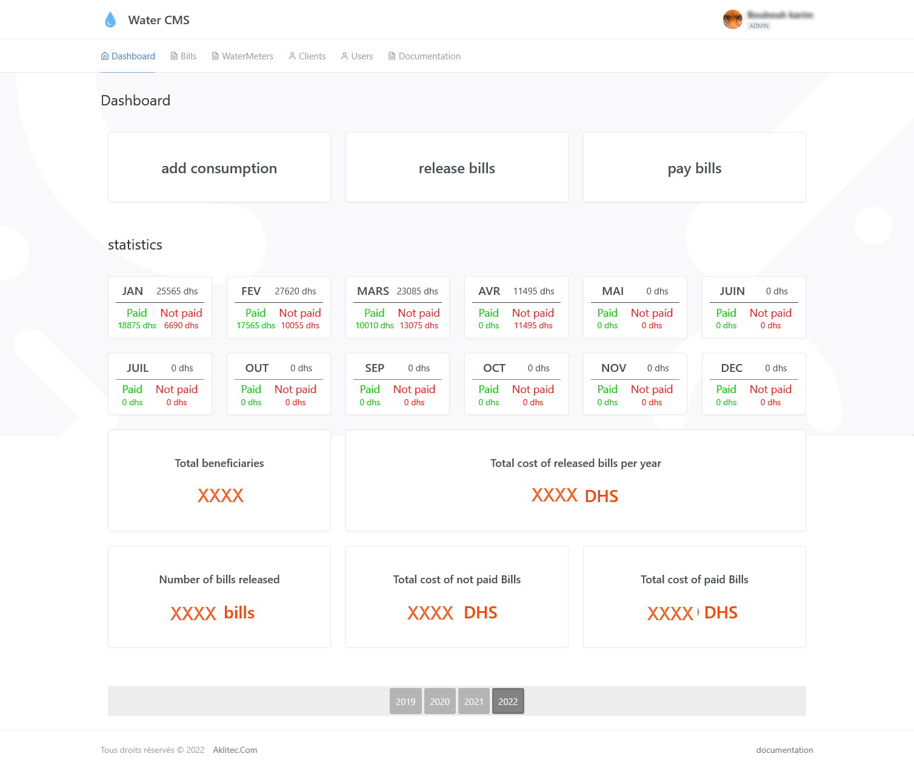
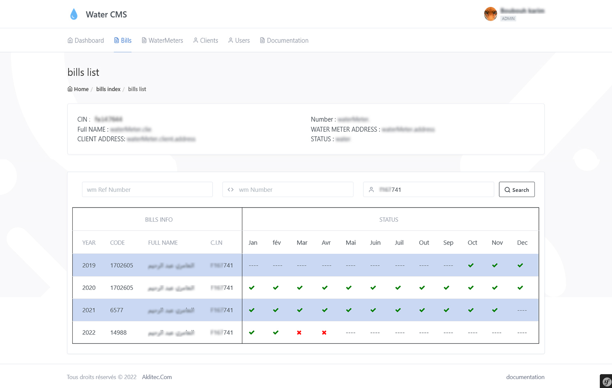
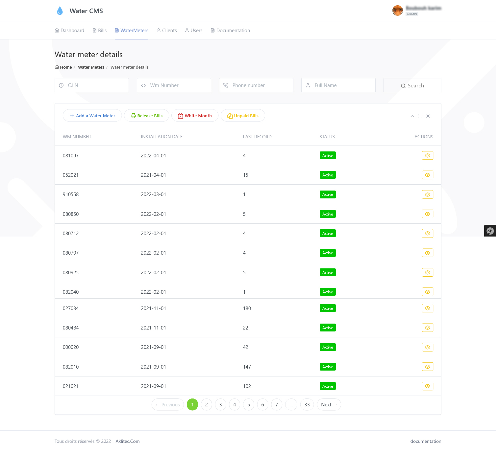
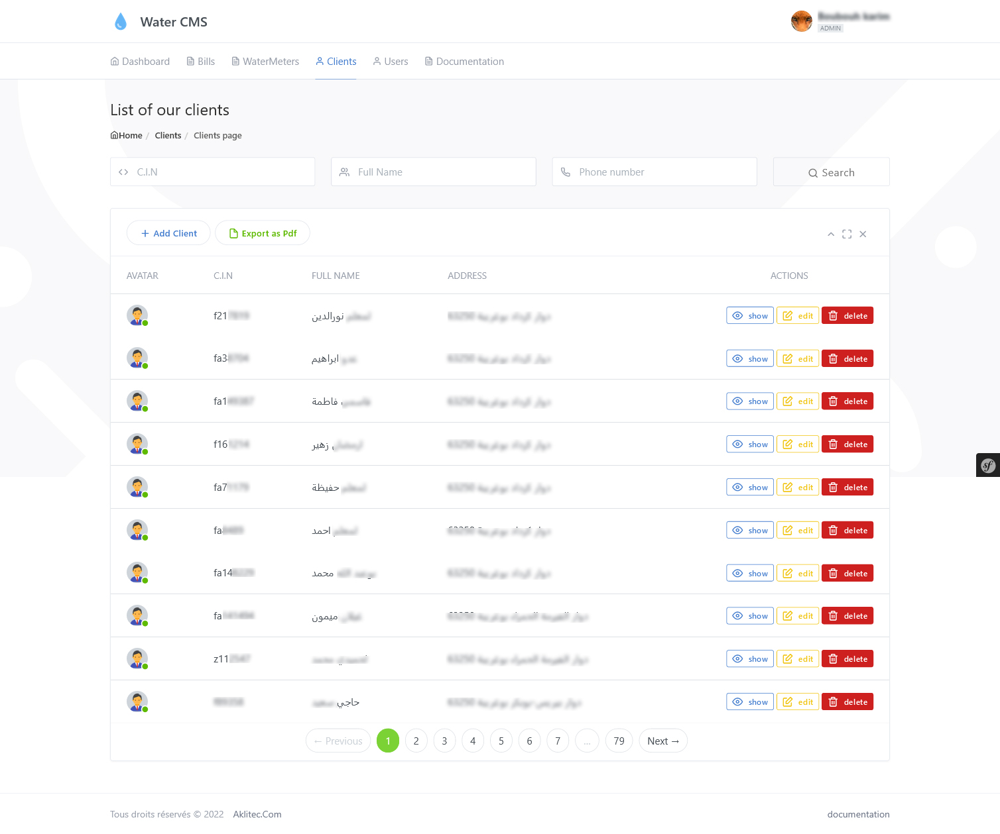
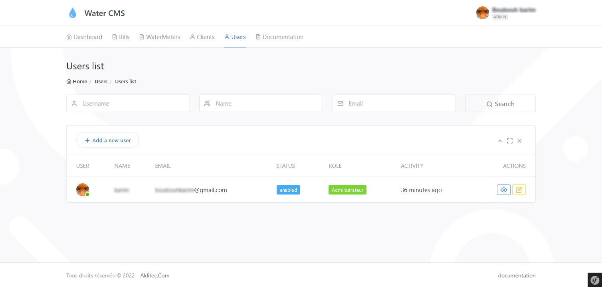

# WaterBills system preview
Water consumption management system, ist intelligent way to create and pay bills, send invoices, and get paid.

 
 

# Dashboaed page
- The dashboard page provide a full view for the entire year, the   total amount for all bills that been released for each month, the amount of money that has been paid and which is pending.
- Total number of the released bills so far during the current year.
- Total money of unpaid bill during the current year.
- Total money of the paid bills during the current year.

a user can add consumption, release or pay a bill from dashboard page.

 
 

# Bills Page
- This page is resposible of displaying Bills for a specific client by inputing either his Water meter reference number or ID-card number or just his water meter number.

- a table shows all bills that have been released and paid which is marked with green check mark, also not paid onces with red X mark for each month of the year, the dashed marked are for either the client thet did not exist at that time or  no bills has been released for him yet.

 
 

# Water Meters 

- The water-meters page is where the admin can add a new water meter when a client request to install one at home.
-a client can have one or multiple water-meters

 
 
# Clients
- This page hold all clients stored in the database, each client is unique, according to the previlige given to each user, an user can add, view, edit or delete a client.

 
 

# Users
- The users page is delicate page, this is where a super-admin can manage users, and give roles to each one.

